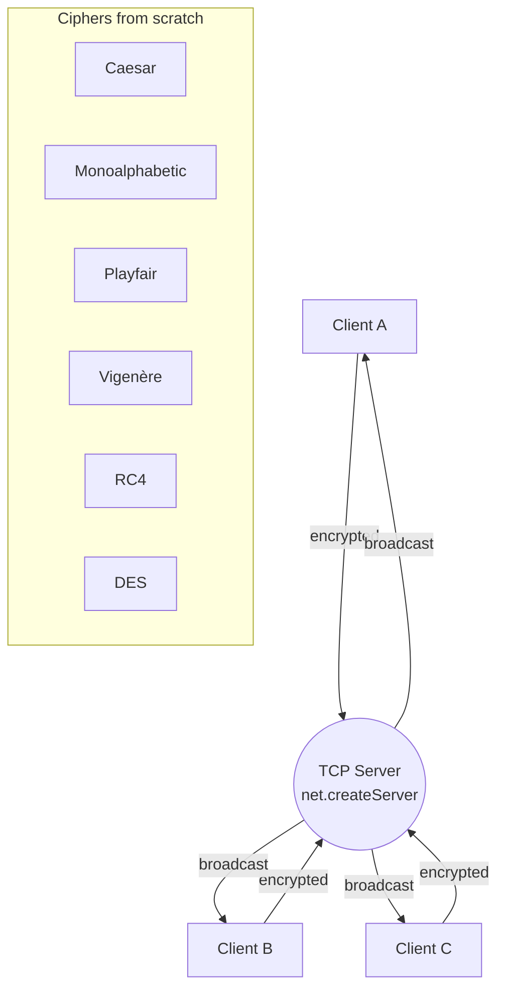

# chat-tcp — TCP chat + classic ciphers (Node.js)

A multi-client **TCP chat** built on raw Node.js sockets, plus a playground of
**classic ciphers implemented from scratch** — messages can be encrypted with
Caesar, Monoalphabetic, Playfair, Vigenère, RC4 or DES before they hit the wire.

## Architecture



## What's inside

- **TCP server** (`server.mjs`) — accepts multiple clients and broadcasts each message
  to all the others, with colorized terminal output via `chalk`.
- **Cipher suite, hand-written (no crypto libs):**

  | Client | Cipher | Args |
  |--------|--------|------|
  | `clientCsr` | **Caesar** | message, shifts |
  | `clientMn`  | **Monoalphabetic** | message, alphabet |
  | `clientPfr` | **Playfair** | init, message, key |
  | `clientVgr` | **Vigenère** | message, key |
  | `rc4`       | **RC4** stream cipher | — |
  | `des` / `des_client` | **DES** (full key schedule + permutations) | — |

## Run it

```bash
npm install
node server.mjs     # terminal 1 — server
node client.mjs     # terminal 2+ — one per client
```

Type a message in any client and it's broadcast to all the others. Launch a
cipher-specific client (e.g. `node clientVgr.mjs`) to send encrypted traffic.

## Stack

Node.js (ESM) · `net` (TCP sockets) · `chalk` · Caesar / Monoalphabetic / Playfair /
Vigenère / RC4 / DES from scratch
